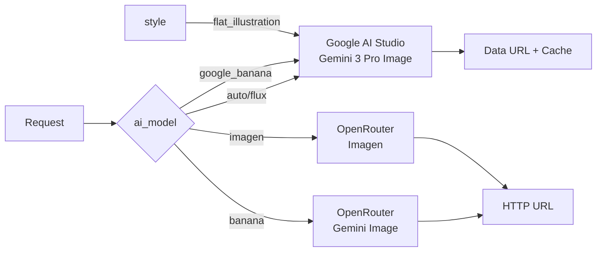

# 🎨 NPE1 Colecture - AI Image Generator

> **Intelligent image finder and generator for PowerPoint presentations**
> Automatically extracts keywords from slides, searches stock photos, and generates AI images when needed.

[](https://fastapi.tiangolo.com/)
[](https://www.python.org/)
[](https://www.docker.com/)

---

## 📋 Table of Contents

- [Features](#-features)
- [Architecture](#-architecture)
- [Quick Start](#-quick-start)
- [API Reference](#-api-reference)
- [Configuration](#-configuration)
- [Deployment](#-deployment)
- [Troubleshooting](#-troubleshooting)

---

## ✨ Features

### 🔍 **Smart Image Discovery**
- Extracts visual keywords from slide content using LLM
- Searches **Unsplash** and **Pexels** stock photo libraries
- Intelligent quality and safety scoring

### 🤖 **AI Image Generation**
- **Google AI Studio** (Gemini 3 Pro Image / Nano Banana Pro) - Default
- **OpenRouter** (Banana/Gemini, Imagen) - Alternative
- **FLUX** - High-quality photorealistic images
- Automatic fallback strategy

### 🎯 **Flexible Modes**
| Mode | Description |
|------|-------------|
| `auto` | Search stock photos first, generate AI image if needed |
| `stock_only` | Only search stock photos, return none if unavailable |
| `ai_only` | Skip stock search, directly generate AI image |

### 🛡️ **Safety & Quality**
- Automated quality scoring via SightEngine
- Nudity/inappropriate content detection
- Automatic retry with safe model if content flagged
- Presentation fit scoring (optional)

---

## 🏗️ Architecture

### System Overview

```
┌─────────────────────────────────────────────────────────────────┐
│                       Client (PowerPoint)                        │
└────────────────────────────┬────────────────────────────────────┘
                             │
                             │ HTTP POST/GET
                             ▼
┌─────────────────────────────────────────────────────────────────┐
│                    FastAPI Server (api.py)                       │
│                    Swagger UI: /docs                             │
└────────────────────────────┬────────────────────────────────────┘
                             │
                             ▼
┌─────────────────────────────────────────────────────────────────┐
│                   Orchestrator (orchestrator.py)                 │
│                                                                   │
│  ┌───────────────────────────────────────────────────────────┐  │
│  │ 1. Keyword Extraction (OpenRouter LLM)                    │  │
│  └───────────────────────────────────────────────────────────┘  │
│                             │                                     │
│                             ▼                                     │
│  ┌───────────────────────────────────────────────────────────┐  │
│  │ 2. Stock Photo Search (Unsplash + Pexels)                 │  │
│  └───────────────────────────────────────────────────────────┘  │
│                             │                                     │
│                             ▼                                     │
│  ┌───────────────────────────────────────────────────────────┐  │
│  │ 3. Quality Scoring (SightEngine)                          │  │
│  └───────────────────────────────────────────────────────────┘  │
│                             │                                     │
│                             ▼                                     │
│  ┌───────────────────────────────────────────────────────────┐  │
│  │ 4. AI Generation (Google AI Studio / OpenRouter / FLUX)  │  │
│  └───────────────────────────────────────────────────────────┘  │
│                             │                                     │
│                             ▼                                     │
│  ┌───────────────────────────────────────────────────────────┐  │
│  │ 5. Safety Check & Cache (generated_cache.py)             │  │
│  └───────────────────────────────────────────────────────────┘  │
└─────────────────────────────────────────────────────────────────┘
                             │
                             ▼
                        Image Result
```

### AI Model Routing



### Component Structure

```
src/
├── api.py                  # FastAPI endpoints & Swagger UI
├── orchestrator.py         # Main pipeline orchestration
├── keyword_extractor.py    # LLM-based keyword extraction
├── image_search.py         # Unsplash/Pexels integration
├── image_scorer.py         # Quality/safety scoring (SightEngine)
├── image_generator.py      # AI image generation
├── generated_cache.py      # In-memory cache for data URLs
├── models.py               # Pydantic data models
├── config.py               # Configuration management
└── prompts.py              # LLM prompts
```

---

## 🚀 Quick Start

### Local Development

```bash
# 1. Clone repository
git clone https://github.com/gurkepunktli/npe1-colecture
cd npe1-colecture

# 2. Create virtual environment
python -m venv venv
.\venv\Scripts\activate  # Windows
# source venv/bin/activate  # Linux/Mac

# 3. Install dependencies
pip install -r requirements.txt

# 4. Configure environment
cp .env.example .env
# Edit .env with your API keys

# 5. Run server
python run_server.py
```

Server runs at: **http://localhost:8080**
API Docs: **http://localhost:8080/docs**

### Docker Compose

```bash
# 1. Configure environment
cp .env.example .env
# Edit .env with your API keys

# 2. Start services
docker-compose up -d

# 3. View logs
docker-compose logs -f

# 4. Stop services
docker-compose down
```

### Portainer

1. Navigate to **Stacks** → **Add Stack**
2. Set name: `npe1-colecture`
3. Repository: `https://github.com/gurkepunktli/npe1-colecture`
4. Compose file: `docker-compose.yml`
5. Add environment variables from `.env.portainer`
6. Deploy

---

## 📡 API Reference

### Endpoints

#### **POST** `/generate-image`

Generate or find an image for a slide.

**Request Body:**

```json
{
  "title": "Digital Transformation in 2025",
  "bullets": [
    {"bullet": "Cloud migration and SaaS adoption"},
    {"bullet": "AI integration in business processes"}
  ],
  "ImageKeywords": ["technology", "cloud", "innovation"],
  "style": "photorealistic",
  "image_mode": "auto",
  "ai_model": "auto",
  "colors": {
    "primary": "#0066CC",
    "secondary": "#00CC66"
  }
}
```

**Response:**

```json
{
  "url": "https://langchain.gurk.li/generated/abc123",
  "source": "generated_google_banana",
  "keywords": "technology, cloud computing, innovation",
  "error": null
}
```

#### **GET** `/generate-image-simple`

Simplified query parameter endpoint.

**Example:**

```
GET /generate-image-simple?title=Digital+Transformation&style=flat_illustration&image_mode=ai_only&ai_model=google_banana&primary_color=%230066CC&keywords=technology,innovation
```

#### **POST** `/extract-keywords`

Extract keywords from slide content without generating image.

**Request Body:**

```json
{
  "title": "Machine Learning Basics",
  "bullets": [
    {"bullet": "Neural networks and deep learning"},
    {"bullet": "Training and validation"}
  ]
}
```

**Response:**

```json
{
  "detailed": {
    "skip": false,
    "english_keywords": ["machine learning", "neural networks", "AI"],
    "topics_de": ["Künstliche Intelligenz", "Neuronale Netze"],
    "style": ["technical", "educational"],
    "negative_keywords": ["cartoon", "abstract"],
    "constraints": {}
  },
  "refined": "machine learning, neural networks, AI"
}
```

### Request Parameters

| Parameter | Type | Options | Default | Description |
|-----------|------|---------|---------|-------------|
| `title` | string | - | - | Slide title (optional if keywords provided) |
| `bullets` | array | - | `[]` | Bullet points with content |
| `ImageKeywords` | array | - | `null` | Override auto-extraction with explicit keywords |
| `style` | string | `flat_illustration`, `fine_line`, `photorealistic`, `modern`, `minimal` | `null` | Visual style or scenario key |
| `image_mode` | string | `auto`, `stock_only`, `ai_only` | `auto` | Image sourcing strategy |
| `ai_model` | string | `auto`, `flux`, `google_banana`, `banana`, `imagen` | `auto` | AI model selection |
| `colors` | object | `{primary, secondary}` | `null` | Color scheme for AI generation |

### AI Model Options

| Model | Provider | Description | Speed | Quality |
|-------|----------|-------------|-------|---------|
| `auto` | Google AI Studio | Default, routes to Gemini 3 Pro Image | ⚡⚡⚡ | ⭐⭐⭐⭐⭐ |
| `flux` | Google AI Studio | Alias for auto (Gemini 3 Pro) | ⚡⚡⚡ | ⭐⭐⭐⭐⭐ |
| `google_banana` | Google AI Studio | Explicit Gemini 3 Pro Image (Nano Banana Pro) | ⚡⚡⚡ | ⭐⭐⭐⭐⭐ |
| `banana` | OpenRouter | Gemini Image via OpenRouter | ⚡⚡ | ⭐⭐⭐⭐ |
| `imagen` | OpenRouter | Google Imagen via OpenRouter | ⚡⚡ | ⭐⭐⭐⭐ |

### Response Sources

| Source | Description |
|--------|-------------|
| `stock_unsplash` | Image from Unsplash stock photos |
| `stock_pexels` | Image from Pexels stock photos |
| `generated_google_banana` | AI-generated via Google AI Studio |
| `generated_banana` | AI-generated via OpenRouter (Gemini) |
| `generated_imagen` | AI-generated via OpenRouter (Imagen) |
| `none` | No suitable image found |
| `failed` | Generation/search failed (returns error.png) |

---

## ⚙️ Configuration

### Environment Variables

#### **Required API Keys**

| Variable | Description | Get Key |
|----------|-------------|---------|
| `OPENROUTER_API_KEY` | OpenRouter API key for LLM services | [openrouter.ai](https://openrouter.ai) |
| `GOOGLE_AI_STUDIO_API_KEY` | Google AI Studio key for Gemini 3 Pro Image | [aistudio.google.com](https://aistudio.google.com) |
| `UNSPLASH_ACCESS_KEY` | Unsplash API key for stock photos | [unsplash.com/developers](https://unsplash.com/developers) |
| `PEXELS_API_KEY` | Pexels API key for stock photos | [pexels.com/api](https://www.pexels.com/api/) |
| `SIGHTENGINE_API_USER` | SightEngine user for quality/safety scoring | [sightengine.com](https://sightengine.com) |
| `SIGHTENGINE_API_SECRET` | SightEngine secret key | [sightengine.com](https://sightengine.com) |
| `FLUX_API_KEY` | FLUX API key (optional, for FLUX model) | [bfl.ai](https://bfl.ai) |

#### **Optional Configuration**

| Variable | Default | Description |
|----------|---------|-------------|
| `PUBLIC_BASE_URL` | `https://langchain.gurk.li` | Public URL for serving generated images |
| `SCORING_SERVICE_URL` | - | Optional presentation fit scoring service |
| `NUDITY_SERVICE_URL` | `http://192.168.100.20:8101` | Preferred nudity analyzer endpoint (`/analyze`), SightEngine used only as fallback |
| `NUDITY_SERVICE_THRESHOLD` | `0.5` | Threshold forwarded to the nudity analyzer |
| `NUDITY_SERVICE_MODEL` | `ViT-L/14` | CLIP model forwarded to the nudity analyzer |
| `MIN_PRESENTATION_SCORE` | `0.6` | Minimum presentation fit score (0-1) |
| `MIN_QUALITY_SCORE` | `0.7` | Minimum image quality score (0-1) |
| `MIN_NUDITY_SAFE_SCORE` | `0.99` | Minimum safety score (0-1) |
| `FLUX_MODEL` | `flux-2-pro` | FLUX model variant |
| `OPENROUTER_REFERER` | - | OpenRouter referer header (recommended) |
| `OPENROUTER_TITLE` | - | OpenRouter title header (recommended) |

### Example `.env` File

```bash
# Required Keys
OPENROUTER_API_KEY=sk-or-v1-xxxxx
GOOGLE_AI_STUDIO_API_KEY=AIzaSyxxxxx
UNSPLASH_ACCESS_KEY=xxxxx
PEXELS_API_KEY=xxxxx
SIGHTENGINE_API_USER=xxxxx
SIGHTENGINE_API_SECRET=xxxxx
FLUX_API_KEY=xxxxx

# Optional Config
PUBLIC_BASE_URL=https://your-domain.com
SCORING_SERVICE_URL=http://192.168.1.100:8000
NUDITY_SERVICE_URL=http://192.168.100.20:8101
NUDITY_SERVICE_THRESHOLD=0.5
NUDITY_SERVICE_MODEL=ViT-L/14
MIN_PRESENTATION_SCORE=0.6
MIN_QUALITY_SCORE=0.7
MIN_NUDITY_SAFE_SCORE=0.99
```

---

## 🐳 Deployment

### Docker Compose

The `docker-compose.yml` configures a production-ready setup:

```yaml
services:
  web:
    build: .
    ports:
      - "8080:8080"
    environment:
      - OPENROUTER_API_KEY=${OPENROUTER_API_KEY}
      - GOOGLE_AI_STUDIO_API_KEY=${GOOGLE_AI_STUDIO_API_KEY}
      # ... other env vars
    restart: unless-stopped
```

### Portainer Stack

1. **Create Stack**: Use the Git repository method
2. **Repository URL**: `https://github.com/gurkepunktli/npe1-colecture`
3. **Compose Path**: `docker-compose.yml`
4. **Environment Variables**: Copy from `.env.portainer`
5. **Deploy**: Click "Deploy the stack"

### Health Check

```bash
curl http://localhost:8080/
```

Expected response:
```json
{
  "service": "NPE1 Colecture Image Generator",
  "status": "running",
  "version": "1.0.0"
}
```

---

## 🔧 Troubleshooting

### Common Issues

#### **401/403 Errors with Stock Photos**

```
Error: 401 Unauthorized from Unsplash
```

**Solution:**
- Verify `UNSPLASH_ACCESS_KEY` and `PEXELS_API_KEY` are correct
- Check API key has not expired
- Ensure API keys have proper permissions

#### **No Images from AI Generation**

```
Error: Image generation failed
```

**Solution:**
- Check `GOOGLE_AI_STUDIO_API_KEY` is valid
- Verify `PUBLIC_BASE_URL` is set for external access
- Review logs: `docker-compose logs -f`
- Test API key: `curl "https://generativelanguage.googleapis.com/v1beta/models?key=YOUR_KEY"`

#### **Low Quality Results**

**Solution:**
- Lower quality thresholds:
  ```bash
  MIN_PRESENTATION_SCORE=0.4
  MIN_QUALITY_SCORE=0.5
  ```
- Disable presentation scoring if external service unavailable:
  ```bash
  SCORING_SERVICE_URL=  # Leave empty
  ```

#### **Images Marked as Unsafe**

```
Generated image not safe enough, regenerating with google_banana
```

**Solution:**
- Adjust safety threshold (lower = more permissive):
  ```bash
  MIN_NUDITY_SAFE_SCORE=0.95  # Down from 0.99
  ```
- Review SightEngine quota/limits
- Check SightEngine logs for false positives

### Debug Mode

Enable verbose logging:

```python
# In run_server.py
import logging
logging.basicConfig(level=logging.DEBUG)
```

### Logs

```bash
# Docker Compose
docker-compose logs -f web

# Local
# Logs printed to console where run_server.py is running
```

---

## 📊 Performance

### Typical Response Times

| Operation | Time | Notes |
|-----------|------|-------|
| Keyword Extraction | 1-2s | OpenRouter LLM |
| Stock Photo Search | 0.5-1s | Parallel Unsplash + Pexels |
| Quality Scoring | 0.3-0.5s | SightEngine API |
| AI Image Generation | 5-15s | Varies by model |
| Total (Stock Found) | 2-4s | - |
| Total (AI Generated) | 7-20s | - |

### Optimization Tips

- **Use `stock_only` mode** when speed is critical
- **Cache results** in your application layer
- **Pre-extract keywords** and pass via `ImageKeywords`
- **Use `google_banana`** for faster AI generation

---

## 🤝 Contributing

Contributions welcome! Please:

1. Fork the repository
2. Create a feature branch
3. Make your changes
4. Submit a pull request

---

## 📄 License

TBD

---

## 🙏 Acknowledgments

- **OpenRouter** - LLM API aggregation
- **Google AI Studio** - Gemini 3 Pro Image (Nano Banana Pro)
- **Unsplash & Pexels** - Stock photo libraries
- **SightEngine** - Image quality and safety scoring
- **FastAPI** - Modern Python web framework

---

**Made with ❤️ for better presentations**
