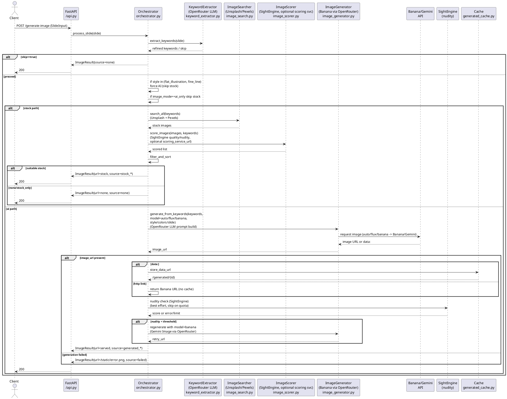

# NPE1 Colecture – Image Generator

AI-powered image finder and generator for PowerPoint slides. Takes slide text, extracts visual keywords, searches stock photos, scores quality/safety, and falls back to AI image generation.

## Overview
- Pipeline: Extract keywords -> search Unsplash/Pexels -> score quality/safety/presentation fit -> generate via Google AI Studio (Nano Banana Pro; auto/flux are routed here) if needed -> return best image.
- FastAPI with Swagger UI (`/docs`).
- LLM via OpenRouter (Gemini/Claude); quality/safety via SightEngine; optional presentation scoring service.

## Required API Keys
`OPENROUTER_API_KEY`, `UNSPLASH_ACCESS_KEY`, `PEXELS_API_KEY`, `SIGHTENGINE_API_USER`, `SIGHTENGINE_API_SECRET`, `FLUX_API_KEY`, `GOOGLE_AI_STUDIO_API_KEY`

Optional: `SCORING_SERVICE_URL`, `MIN_PRESENTATION_SCORE`, `MIN_QUALITY_SCORE`, `MIN_NUDITY_SAFE_SCORE`, `PUBLIC_BASE_URL`, `OPENROUTER_REFERER`, `OPENROUTER_TITLE`, `FLUX_MODEL`

## Quick Start
- Local: `python -m venv venv && venv\Scripts\activate` -> `pip install -r requirements.txt` -> `.env` aus `.env.example` fuellen -> `python run_server.py`
- Docker Compose: `.env` fuellen -> `docker-compose up -d` -> `docker-compose logs -f`
- Portainer: Stack aus Repo `https://github.com/gurkepunktli/npe1-colecture`, Compose `docker-compose.yml`, Env Vars setzen, deploy.

## API

### POST /generate-image (JSON)
```json
{
  "title": "Digital Transformation",
  "bullets": [
    {"bullet": "Cloud migration and SaaS adoption"},
    {"bullet": "AI integration in business processes"}
  ],
  "ImageKeywords": ["technology", "innovation"],   // optional, overrides auto extraction
  "style": "flat_illustration",                    // style or scenario key
  "image_mode": "auto",                            // stock_only | ai_only | auto
  "ai_model": "auto",                              // auto/flux -> google_banana (Nano Banana Pro), banana/imagen (OpenRouter)
  "colors": { "primary": "#0066CC", "secondary": "#00CC66" }
}
```

### GET /generate-image-simple (Query)
```
/generate-image-simple?title=Digital+Transformation&style=flat_illustration&image_mode=ai_only&ai_model=auto&primary_color=%230066CC&secondary_color=%2300CC66&keywords=technology,innovation
```

### Fields (POST /generate-image)
- `title` string
- `bullets` array (optional)
- `ImageKeywords` array (optional; overrides extraction)
- `style` string (optional; scenario keys: `flat_illustration`, `fine_line`, `photorealistic`)
- `image_mode` `stock_only` | `ai_only` | `auto` (default)
- `ai_model` `auto`/`flux` (both route to google_banana), `banana`/`imagen` (OpenRouter), `google_banana` (AI Studio) (default: auto)
- `colors` object optional `{ "primary": "...", "secondary": "..." }`

### Image Modes & Sources
- Modes: `stock_only` (only stock), `ai_only` (only AI), `auto` (stock then AI fallback)
- Response `source`: `stock_unsplash`, `stock_pexels`, `generated_banana`, `generated_imagen`, `generated_google_banana`, `none`, `failed`

## Architecture
- `src/config.py` - configuration/env
- `src/models.py` - Pydantic models
- `src/keyword_extractor.py` - LLM keyword extraction
- `src/image_search.py` - Unsplash/Pexels
- `src/image_scorer.py` - quality/safety/presentation scoring
- `src/image_generator.py` - Google AI Studio (Nano Banana Pro; auto/flux routed here), Banana/Gemini image (OpenRouter)
- `src/orchestrator.py` - pipeline orchestration
- `src/api.py` - FastAPI endpoints
- `src/generated_cache.py` - in-memory cache for data URLs/downloads

## Flow (mit externen Diensten)
- Client -> FastAPI `/generate-image`
- Orchestrator: ggf. Uebersetzung ins Englische, Szenario-Check (flat_illustration/fine_line -> AI-only)
- KeywordExtractor (OpenRouter LLM) -> Keywords/skip
- Stock-Suche (Unsplash/Pexels) falls erlaubt
- Scoring (SightEngine: quality/nudity; optional `scoring_service_url`)
- Wenn Stock geeignet: bestes Bild, URL im Log
- Sonst KI:
  - Prompt-Bau (OpenRouter LLM, Szenario/Style/Colors, Negativ-Prompt)
  - Google AI Studio (Nano Banana Pro mit Gemini 3 Pro Image); auto/flux werden hierhin gemappt, oder Banana (Gemini Image via OpenRouter)
  - Data-URLs werden gecached unter `/generated/{id}` (mit `PUBLIC_BASE_URL`, sonst Fallback); Banana-HTTP-Links gehen direkt zurück
- Nudity-Check auf generiertem Bild (SightEngine, skip bei Quota/Fehler)
- Bei unsafe (< `MIN_NUDITY_SAFE_SCORE`): ein Retry mit Google AI Studio (Nano Banana Pro)
- Fallback bei Fehler: `/static/error.png`

## Sequence Diagram (PlantUML)


## Troubleshooting
- 401/403 stock: check Unsplash/Pexels keys.
- Empty/failed: check logs, consider lowering thresholds, disable presentation scoring (`SCORING_SERVICE_URL`).
 - No image from AI: check OpenRouter (Banana/Gemini) key; set `PUBLIC_BASE_URL` for external access; review generation logs.

## License
TBD
