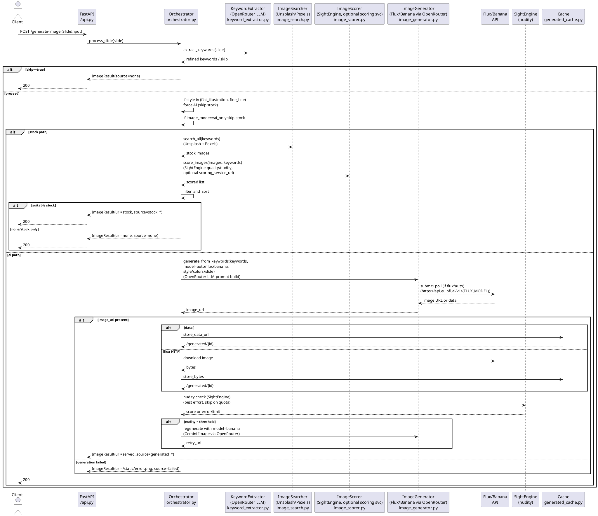

```plantuml
@startuml
actor Client
participant "FastAPI\n/api.py" as API
participant "Orchestrator\norchestrator.py" as ORCH
participant "KeywordExtractor\n(OpenRouter LLM)\nkeyword_extractor.py" as KE
participant "ImageSearcher\n(Unsplash/Pexels)\nimage_search.py" as IS
participant "ImageScorer\n(SightEngine, optional scoring svc)\nimage_scorer.py" as ISC
participant "ImageGenerator\n(Flux/Banana via OpenRouter)\nimage_generator.py" as IG
participant "Flux/Banana\nAPI" as FLUX
participant "SightEngine\n(nudity)" as SE
participant "Cache\ngenerated_cache.py" as CACHE

Client -> API: POST /generate-image (SlideInput)
API -> ORCH: process_slide(slide)

ORCH -> KE: extract_keywords(slide)
KE --> ORCH: refined keywords / skip

alt skip==true
  ORCH --> API: ImageResult(source=none)
  API --> Client: 200
else proceed
  ORCH -> ORCH: if style in (flat_illustration, fine_line)\nforce AI (skip stock)
  ORCH -> ORCH: if image_mode==ai_only skip stock

  alt stock path
    ORCH -> IS: search_all(keywords)\n(Unsplash + Pexels)
    IS --> ORCH: stock images
    ORCH -> ISC: score_images(images, keywords)\n(SightEngine quality/nudity,\noptional scoring_service_url)
    ISC --> ORCH: scored list
    ORCH -> ORCH: filter_and_sort
    alt suitable stock
      ORCH --> API: ImageResult(url=stock, source=stock_*)
      API --> Client: 200
    else none/stock_only
      ORCH --> API: ImageResult(url=none, source=none)
      API --> Client: 200
    end
  else ai path
    ORCH -> IG: generate_from_keywords(keywords,\nmodel=auto/flux/banana,\nstyle/colors/slide)\n(OpenRouter LLM prompt build)
    IG -> FLUX: submit+poll (if flux/auto)\n(https://api.eu.bfl.ai/v1/{FLUX_MODEL})
    FLUX --> IG: image URL or data:
    IG --> ORCH: image_url

    alt image_url present
      alt data:
        ORCH -> CACHE: store_data_url
        CACHE --> ORCH: /generated/{id}
      else flux HTTP
        ORCH -> FLUX: download image
        FLUX --> ORCH: bytes
        ORCH -> CACHE: store_bytes
        CACHE --> ORCH: /generated/{id}
      end
      ORCH -> SE: nudity check (SightEngine)\n(best effort, skip on quota)
      SE --> ORCH: score or error/limit
      alt nudity < threshold
        ORCH -> IG: regenerate with model=banana\n(Gemini Image via OpenRouter)
        IG --> ORCH: retry_url
      end
      ORCH --> API: ImageResult(url=served, source=generated_*)
    else generation failed
      ORCH --> API: ImageResult(url=/static/error.png, source=failed)
    end
    API --> Client: 200
  end
end
@enduml
```
